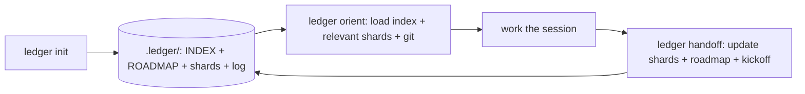

# ledger

ledger is a Claude Code skill that replaces a single growing handoff file with a sharded project-memory library. A thin always-loaded index describes every concern at a glance; separate shard files hold the detail. Each session and each subagent loads only the index plus the shards it actually needs, keeping context windows small and relevant without sacrificing continuity.

## How It Works



## Why Sharded

A single handoff file is re-read in full at the start of every session. As the file grows it costs more tokens and buries the relevant part deeper. With ledger, `orient` loads only the index plus the shards that match the session's concern, so the model sees the right detail without the noise. A subagent focused on one task loads only its relevant shards and ignores the rest.

## Commands

| Command | When | What it does |
|---|---|---|
| `ledger init` | Once per project | Creates `.ledger/` with an index, roadmap, empty shard directory, and session log |
| `ledger orient` | Session start | Loads the index, selects relevant shards, reads git state, and tells you where you are |
| `ledger handoff` | Session end | Updates touched shards and the roadmap, appends to the session log, and emits a copy-pasteable next-session kickoff prompt |

## Layout

After `ledger init` your project contains:

```
.ledger/
  INDEX.md          # always loaded; one line per concern with shard pointers
  ROADMAP.md        # milestones, current status, and launch-readiness
  shards/           # one file per concern (e.g. auth.md, payments.md)
  log/
    sessions.md     # append-only session record
```

## Install

1. Clone this repo:

   ```
   git clone git@github.com:vsruthi00/ledger.git
   ```

2. Make the skill discoverable by Claude Code. The skill entry point is `adapters/claude-code/SKILL.md`, and it reads its procedures from the repo's `core/` directory, so keep the repo intact rather than copying the SKILL.md alone. Place or symlink the repo where Claude Code looks for skills (your Claude Code skills directory, for example `~/.claude/skills/ledger/`, or a plugin you load). Confirm `ledger` shows up in your available skills before continuing.

3. Use the three commands in your sessions:

   ```
   ledger init      # first time only
   ledger orient    # start of every session
   ledger handoff   # end of every session
   ```

## License

PolyForm Perimeter 1.0.0. Free for any use including commercial projects. You may not repackage and sell ledger itself as a competing product. See [LICENSE](LICENSE) for the full terms.

## Portability

ledger is built entirely on Claude Code primitives: a `SKILL.md` entry point and standard file-read/write tools. No scripts, no daemons. Cursor and Codex adapters are planned for a future release.
