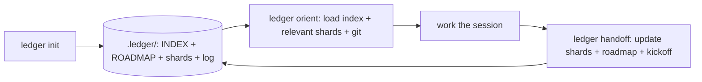

# ledger

ledger is a Claude Code skill that replaces a single growing handoff file with a sharded project-memory library. A thin always-loaded index describes every concern at a glance; separate shard files hold the detail. Each session and each subagent loads only the index plus the shards it actually needs, keeping context windows small and relevant without sacrificing continuity.

## The Council Suite

ledger is one of three companion Claude Code skills that take a unit of work from decision to shipped. Each works on its own; together they compose.

- **[council](https://github.com/vsruthi00/council)** - convene a panel of specialist roles to deliberate a decision and produce a ranked decision record with recorded dissent and hard vetoes.
- **[cadence](https://github.com/vsruthi00/cadence)** - carry a decision through planning, execution, re-invocation, and a security gate while keeping the context window economical.
- **ledger** (this repo) - replace a single growing handoff file with a sharded project-memory library, so each session and subagent loads only the shards it needs.

council decides; cadence drives the resulting work and re-invokes council when something changes; ledger preserves continuity across sessions.

## How It Works



## Why Sharded

A single handoff file is re-read in full at the start of every session. As the file grows it costs more tokens and buries the relevant part deeper. With ledger, `orient` loads only the index plus the shards that match the session's concern, so the model sees the right detail without the noise. A subagent focused on one task loads only its relevant shards and ignores the rest.

## Commands

| Command | When | What it does |
|---|---|---|
| `ledger init` | Once per project | Creates `.ledger/` with an index, roadmap, empty shard directory, and session log |
| `ledger orient` | Session start | Loads the index, selects relevant shards, reads git state, and tells you where you are |
| `ledger handoff` | Session end | Updates touched shards and the roadmap, appends to the session log, and emits a copy-pasteable next-session kickoff prompt |

## Layout

After `ledger init` your project contains:

```
.ledger/
  INDEX.md          # always loaded; one line per concern with shard pointers
  ROADMAP.md        # milestones, current status, and launch-readiness
  shards/           # one file per concern (e.g. auth.md, payments.md)
  log/
    sessions.md     # append-only session record
```

## Structure

This repo (the skill itself, distinct from the `.ledger/` library it creates in a project):

```
ledger/
  SKILL.md            # Claude Code entry point (the skill loads from here)
  core/               # platform-agnostic procedures and templates
    flow/             # init, orient, handoff, shard-selection
    prompts/          # kickoff-generator, shard-split, you-are-here
    schema/           # index, roadmap, session-log, shard templates
  README.md
  LICENSE
```

`SKILL.md` is the Claude Code entry point and reads everything it needs from `core/`. The `core/` directory is platform-agnostic. ledger has no platform-specific runtime code, so there are no extra adapter assets; future adapters for other agents would live under `adapters/<platform>/`.

## Install

1. Clone this repo:

   ```
   git clone git@github.com:vsruthi00/ledger.git
   ```

2. Make the skill discoverable by Claude Code. Claude Code loads a personal skill from `~/.claude/skills/<name>/SKILL.md`. The entry point `SKILL.md` lives at this repo's root and reads its procedures from `core/`, so symlink the whole repo (keeping it intact) into your skills directory:

   ```
   ln -s "$(pwd)" ~/.claude/skills/ledger
   ```

   Confirm `ledger` shows up in your available skills before continuing. (If you prefer not to symlink, copy the repo to `~/.claude/skills/ledger/` instead.)

3. Use the three commands in your sessions:

   ```
   ledger init      # first time only
   ledger orient    # start of every session
   ledger handoff   # end of every session
   ```

## License

PolyForm Perimeter 1.0.0. Free for any use including commercial projects. You may not repackage and sell ledger itself as a competing product. See [LICENSE](LICENSE) for the full terms.

## Adapters and Other Agents

ledger is built entirely on portable primitives: a `SKILL.md` entry point and standard file-read/write operations. No scripts, no daemons.

**Claude Code (available now):** install as above. The root `SKILL.md` is the entry point and reads its procedures from `core/`.

**Cursor, Codex, Gemini (planned):** each will get an adapter under `adapters/<platform>/` that points at the same `core/`. To add one, write that platform's skill or command entry so it runs the `core/flow/*.md` procedures (init, orient, handoff) and uses the `core/schema/*.template.md` files, exactly as `SKILL.md` describes. The `core/` directory does not change. These adapters are not built yet; the seam is in place so they are a small addition rather than a rewrite.
